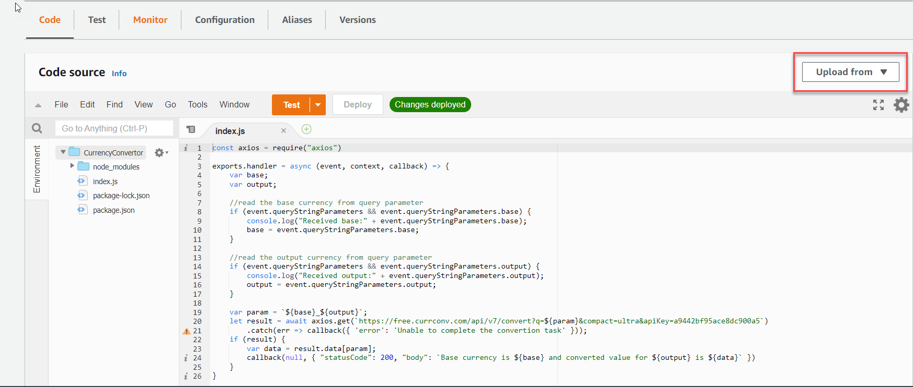
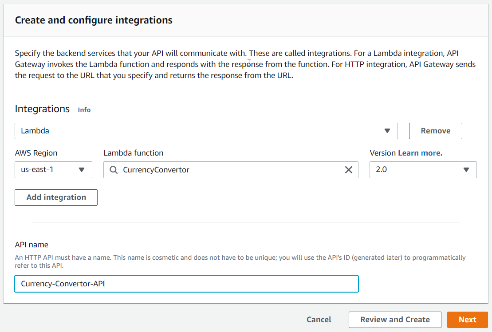
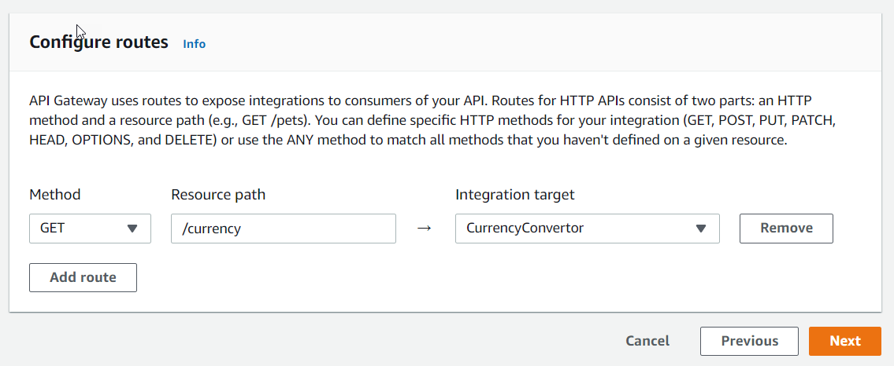

# Microservice using AWS Lambda and API Gateway

AWS Lambda is a powerful service that allows users to build applications that needs to run in a serverless environment. You can build applications without provisioning any infrastructure. This helps developers to focus on the code development rather than spending time on infrastructure provisioning, scaling, monitoring and configuring high availability. You are charged based on the number of requests for your functions and the duration it takes for your code to execute.

This tutorial will guide you through the steps to build a simple HTTP API microservice deployed on AWS Lambda with API Gateway integration. 

## Prerequisites
* Create a new AWS account or use an existing AWS account
* Create a Free API key for the Currency convertor API on [https://free.currencyconverterapi.com/](https://free.currencyconverterapi.com/)
* Visual Studio Code
* NodeJS 14.x or later

## Create AWS Lambda for Currency Calculator HTTP API
1) Open AWS management portal by navigating to [https://console.aws.amazon.com/](https://console.aws.amazon.com/) and login to your AWS account.
2) Search for AWS Lambda and create a new AWS lambda from the Lambda management console.
    
    a) Select 'Author from scratch' option.

    b) Specify the function name as 'CurrencyConvertor', set runtime as 'NodeJS' and select architecture type as 'x86_64'.

    c)  Leave the other options as default and click on 'Create function' button.

    d) This will create a Lambda fucntion. 

3) Now, you need to create a folder with the name 'currency-convertor-api' and open it in Visual Studio code.
4) Open terminal and run the following command from the folder path to create the `package.json` .
    
    ```dos
    npm init -y
    ```

5) Install the `axios` library for the project by running the following command.
    ```dos
    npm install -S axios
    ```

6) create an `index.js` and add the following code snippet to it.
    ```javascript
    const axios = require("axios")

    exports.handler = async (event, context, callback) => {
        var base;
        var output;
    
        //read the base currency from query parameter
        if (event.queryStringParameters && event.queryStringParameters.base) {
            console.log("Received base:" + event.queryStringParameters.base);
            base = event.queryStringParameters.base;
        }
    
        //read the output currency from query parameter
        if (event.queryStringParameters && event.queryStringParameters.output) {
            console.log("Received output:" + event.queryStringParameters.output);
            output = event.queryStringParameters.output;
        }
    
        var param = `${base}_${output}`;
        let result = await axios.get(`https://free.currconv.com/api/v7/convert?q=${param}&compact=ultra&apiKey=a9442bf95ace8dc900a5`)
            .catch(err => callback({ 'error': 'Unable to complete the convertion task' }));
        if (result) {
            var data = result.data[param];
            callback(null, { "statusCode": 200, "body": `Base currency is ${base} and converted value for ${output} is ${data}` })
        }
    }
    ```

    > [!NOTE]
    > You need to create a free tier account in the [https://free.currencyconverterapi.com/](https://free.currencyconverterapi.com/) website to get a free API key. The API key need to be used in the API URL which you are calling using the axios library.

7) Now, you need to upload the code to the Lambda which you have created in the step 2. For that select all files including the `node_modules` and compress in to zip format. 

8) Navigate to the Lambda function dashboard and select the `Upload from` button and choose `.zip file`. 

9) Select the zip file of your project and upload it. After the upload process completes you will be able to see the source code in the code editor window of Lambda function.

    

10) You need to integrate the API gateway to access the Lambda function using an Http endpoint. 

11) Navigate to API gateway dashboard in AWS management console and clik `Build` button for `HTTP API` to create a new API.

12) Click on the `Add integration` button and select `Lambda` as integration type. Specify your region of `CurrencyConvertor` Lambda function and choose it from the Lambda function textbox. 

13) Specify the name of the API as `Currency-Convertor-API` and click on `Next`.
    
    

14) In the `configure routes` page specify the method as `GET` and resource path as `/currency`. Click `Next` to continue.
    
    

15) In the `configure stages` page leave the stage name as `$default`. Enable auto deploy option. Click `Next `.

16) In the `Review and create` page and click on the `Create` button to create the API gateway.

17) After the API gateway is created successfully, you will get an Http endpoint Url. Copy and paste the url to browser with the query string parameters `base` and `output`. Below is the example: 

    ```
    https://a5gk5sdon8.execute-api.us-east-1.amazonaws.com/currency?base=USD&output=INR
    ```


